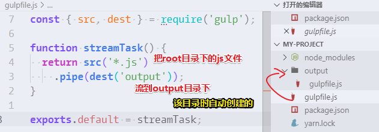

# Gulp入门

## ★引子

搞小程序的时候，需要用到gulp来搭建环境！很多人都说2019年的前端根本就不需要学 gulp，因为有webpack呀！可是，在我看来，学习gulp还是很有必要的，因为这会加深你对webpack的认识！

## ★资料

**➹：**[JavaScript and Gulpfiles · gulp.js](https://gulpjs.com/docs/en/getting-started/javascript-and-gulpfiles)

**➹：**[用Gulp理顺你的前端工作流，山地人用14节课带你玩溜Gulp - 哔哩哔哩](https://www.bilibili.com/read/cv1959803/)

## ★快速开始

> 对如何配置 Gulp 有个大概的了解

1. 检查 node、npm 和 npx 是否正确安装

```bash
# 8.x
node --version

# 5.x
npm --version

# npm 从5.2版开始，增加了npx 命令
npx --version
```

2. 安装 gulp 命令行工具

```bash
yarn global add gulp-cli
```

3. 进入xxx项目，`yarn init`

4. 安装 gulp，作为开发时依赖项

```bash
yarn add -D gulp 
```

5. 检查 gulp 版本

```bash
gulp -v
```

6. 在项目的根目录下创建一个名为 `gulpfile.js` 的文件，并在文件中输入以下内容：

```js
function defaultTask(cb) {
  // place code for your default task here
  cb();
  //console.log(1)
}

exports.default = defaultTask
```

7. 测试，在项目根目录下执行 gulp 命令： `gulp`。如需运行多个任务（task），可以执行 `gulp <task> <othertask>`。

8. 输出结果。默认任务（task）将执行，因为任务为空，因此没有实际动作。

::: warning

关于API，4.x版的gulp和3.x版的相比，有了一些变化，所以你安装 gulp 时，得看看是不是 4.x 版的！

:::

## ★为什么要学 Gulp？

> 增加你对 Gulp 学习的动力！

- 它是什么？——是一个自动化构建工具。
- 它用来干嘛的？——增强你的工作流程！
- 谁用到了它？——如把sass文件编译成css、js打包输出、element ui 组件库里边有用到它……
- 它的特点？
  - 简单：代码优于配置、node 最佳实践、精简的 API 集，gulp 让工作前所未有的简单。
  - 高效：基于 node 强大的流(stream)能力，gulp 在构建过程中并不把文件立即写入磁盘，从而提高了构建速度。
  - 生态：遵循严格的准则，确保我们的插件结构简单、运行结果可控。
- 学习它的好处？
  - 看一些前端开源库的时候，看到 `gulpfile.js`这个文件的时候，就知道这是个干嘛的文件！
  - 压缩记笔记时引入的图片
  - ……
- 怎么学它？
  - 看[英文版](https://gulpjs.com/docs/en/getting-started/quick-start)的教程或[中文版](https://www.gulpjs.com.cn/docs/getting-started/quick-start/)的最新教程！（英文教程会有最新的内容，而中文可能没有，总之就是英文和中文结合着来看呗）

## ★使用Gulp创建各种类型的Task任务

> 开始掌握 Gulp 的正确使用方法！

### ◇JavaScript 和 Gulpfile

不要认为写个Gulpfile会很难，因为这里边的内容，都是用纯 JavaScript 代码 来写的，当然，gulp 也提供了一些实用工具来简化文件系统和命令行的操作，但学习这些工具的使用，也并不困难！

总之，写个 Gulpfile 是件很简单的事儿！

### ◇Gulpfile 详解

- Gulpfile 是什么？——它是项目目录下名为 `gulpfile.js` 的文件，或者首字母大写 `Gulpfile.js`也行
- 该文件是如何被执行的？——在运行 `gulp` 命令时会被自动加载
- 该文件里边有啥东东？—— 常见的诸如`src()`「源」、`dest()`「目的地」、`series()`「串行的，任务一个接一个」 或 `parallel()`「并行的，可以同时搞多个个任务」 函数之类的 gulp API，当然，原生的 JS 以及 Node 模块 也可以使用呀！

::: warning

任何导出（export）的函数都将注册到 gulp 的任务（task）系统中。所以task要被执行，得注册到 gulp的任务系统里边去才行！

:::

### ◇Gulpfile 转译

- 我能用其它语言写 Gulpfile？—— 可以使用 TypeScript 或 Babel，不过你需要安装匹配的转译模块（transpiler module），如
  - 对于 TypeScript，你得重命名为 `gulpfile.ts` 并安装 [ts-node](https://www.npmjs.com/package/ts-node) 模块。
  - 对于 Babel，你得重命名为 `gulpfile.babel.js` 并安装 [@babel/register](https://www.npmjs.com/package/@babel/register) 模块。

> 一般来说，直接用 JS 来写就好了。

::: tip

node的最新版大多支持 **TypeScript**  和 **Babel** 所提供的特性，除了 `import/export`以外，当然，如果你需要用到这个语法的话，那就安装 [esm](https://www.npmjs.com/package/esm) 模块，并且把文件重命名为 `gulpfile.esm.js`

:::

### ◇Gulpfile 分割

- 为啥需要分割？——起初将所有业务逻辑都写到一个 gulpfile 文件里边，但，当你项目变大了，那么该文件也变大，而变大了就不好管理了，因此我们可以将此文件重构为数个独立的文件
- 如何分割？（两种姿势）
  - 每个任务（task）可以被分割为独立的文件，然后导入（import）到 gulpfile 文件中并组合。
  - 使用Node 的模块解析功能，搞一个叫 `gulpfile.js`的目录，然后该目录里边包含了一个名为 `index.js` 的文件，而该文件被当作 `gulpfile.js` 使用，并且，该目录中还可以包含各个独立的任务（task）模块。说白了 `index.js` 就是个入口文件呗！然后，其它的`task`模块就`require`进来哈！

### ◇创建任务

> 每个 gulp 任务（task）都是一个异步的 JavaScript 函数，该函数接收一个 error-first callback或者返回一个stream, promise, event emitter, child process, or observable 。由于一些平台限制，所以就不支持同步任务了。

任务有两种，一种是公开的，一种是私有的。私有的任务被export了，那就变成公开任务，反之咩有的话，那就是 被设计为在内部使用，通常作为 `series()` 或 `parallel()` 组合的组成部分。

总之，**私有任务就是无法被用户直接调用**，在外观和行为上和其他任务（task）是一样的。

```js
const { series } = require('gulp');
// console.log(1)
// `clean` 函数并未被导出（export），因此被认为是私有任务（private task）。
// 它仍然可以被用在 `series()` 组合中。
function clean(cb) {
  // body omitted
  cb();
  // console.log('clean')
}

// `build` 函数被导出（export）了，因此它是一个公开任务（public task），并且可以被 `gulp` 命令直接调用。
// 它也仍然可以被用在 `series()` 组合中。
function build(cb) {
  // body omitted
  cb();
 // console.log('build')
}
// console.log(2)
exports.build = build;
exports.default = series(clean, build);
```

1. 查看当前任务系统，注册了哪些任务：`npx gulp --tasks`  or `gulp --tasks` or `yarn build --tasks` or `npm run build --tasks`（gg）。使用 `npx`用的是当前项目的 `gulp`命令，不使用则是用的是全局的 `gulp`命令。在 `package.json`里边添加 `"build": "gulp"`这个`scripts`，使用`yarn build`意味着执行的`gulp`命令是本地的，而用`npm`姿势的话，得添加 `run`，带参数的话，还得这样 `-- --tasks`，即 `npm run build -- --tasks`。（所以用 `yarn` 要方便许多！）

```
[15:16:04] Tasks for G:\git-2019\test\my-project\gulpfile.js
[15:16:04] ├── build
[15:16:04] └─┬ default
[15:16:04]   └─┬ <series>
[15:16:04]     ├── clean
[15:16:04]     └── build
```

2. 指定执行某个任务（即执行公开的任务），如执行 `build`任务：`gulp build`

```
[14:48:15] Using gulpfile G:\git-2019\test\my-project\gulpfile.js
[14:48:15] Starting 'build'...
[14:48:15] Finished 'build' after 14 ms
```

3. 执行默认任务：`gulp default` or `gulp`

```
[14:49:40] Using gulpfile G:\git-2019\test\my-project\gulpfile.js
[14:49:40] Starting 'default'...
[14:49:40] Starting 'clean'...
[14:49:40] Finished 'clean' after 1.99 ms
[14:49:40] Starting 'build'...
[14:49:40] Finished 'build' after 1.08 ms
[14:49:40] Finished 'default' after 14 ms
```

可见，执行`defalut`任务，需要先执行 `clean`任务，该任务结束后，才能执行 `build`任务！

::: warning

上边的`task`里边，都有 `cb()`，在 `cb()`上边，添加`log`，和在其下边，添加 `log`是有区别的！在上边，只要任务启动就会去执行，而在下边的话，是等一个任务结束后，下一个任务的开始后，才会去执行。而写在任务外边的代码，则加载这个 `gulpfile.js`就会去执行。

:::

::: tip

4.x之前的gulp版本，即3.x版，用的是`task()` 方法用来将函数注册为任务（task），不过，就目前而言，使用 `exports`来注册任务这种机制，才是王道，除非 `exports`在某些特殊场景下无法使用！

总之，就目前而言，你使用 `task()`来注册任务也是可以的，不过，你目前用了4.x的gulp，还是用 `exports`的姿势来注册任务比较好。

:::

### ◇组合（Compose）任务

> 何时使用并行？——两个不相关的任务就可以使用并行，如果压缩 JS 文件和 CSS 文件
>
> `livereload`是自动更新，热加载，说白了，就是**只要文件一保存，浏览器就会马上刷新了**
>
> `transpile`：转译，在前端里边也有人叫它为编译（compile）
>
> `bundle`：打包之意
>
> 一个项目有生产环境和开发环境
>
> 一个任务里边，你咩有写 `cb()`的话，那么当你 `series` 几个任务时，往下的任务也是不会被执行的！因为调用 `cb`是一个信号，标志着这个任务完成了！

Gulp 提供了两个强大的组合方法： `series()` 和 `parallel()`，允许将多个独立的任务组合为一个更大的操作。这两个方法都可以接受任意数目的任务（task）函数或已经组合的操作。`series()` 和 `parallel()` 可以互相嵌套至任意深度。

- 何时使用 `series()` 方法？
  - 需要让任务（task）按顺序执行

```js
const { series } = require('gulp');

function transpile(cb) {
  // body omitted
  cb();
}

function bundle(cb) {
  // body omitted
  cb();
}

exports.build = series(transpile, bundle);
```

> 编译后打包

- 何时使用 `parallel()` 方法？
  - 要使任务以最大并发运行

```js
const { parallel } = require('gulp');

function javascript(cb) {
  // body omitted
  cb();
}

function css(cb) {
  // body omitted
  cb();
}

exports.build = parallel(javascript, css);
```

>  JS 和 CSS 谁也不搭理谁

- 当 `series()` 或 `parallel()` 被调用时，任务（tasks）被立即组合在一起。让任务在组合中改变，而不是在单个任务里边进行判断，以此来选择具体执行哪个任务：

```js
const { series } = require('gulp');

function minify(cb) {
  // body omitted
  cb();
}


function transpile(cb) {
  // body omitted
  cb();
}

function livereload(cb) {
  // body omitted
  cb();
}

if (process.env.NODE_ENV === 'production') {
  exports.build = series(transpile, minify);
} else {
  exports.build = series(transpile, livereload);
}
```

> 如果是生产环境下的，那就执行A这组任务咯！如果不是，那就执行B这组件任务咯！而不是，在单个任务里边判断，如选择的是 `minify` 还是`livereload`？

- `series()` 和 `parallel()` 可以被嵌套到任意深度。

```js
const { series, parallel } = require('gulp');
exports.build = series(
  clean,
  parallel(
    cssTranspile,
    series(jsTranspile, jsBundle)
  ),
  parallel(cssMinify, jsMinify),
  publish
);
```

- 当一个组合操作执行时，这个组合中的每一个任务每次被调用时都会被执行。例如，在两个不同的任务（task）之间调用的 `clean` 任务（task）将被执行两次，并且将导致不可预期的结果。因此，最好在最终的任务组合中重构一下 `clean` 任务（task）。

bad 代码：

```js
// This is INCORRECT
const { series, parallel } = require('gulp');

const clean = function(cb) {
  // body omitted
  cb();
};

const css = series(clean, function(cb) {
  // body omitted
  cb();
});

const javascript = series(clean, function(cb) {
  // body omitted
  cb();
});

exports.build = parallel(css, javascript);
```

> 并行执行两个任务，执行css这个任务组，想执行clean，而  JS 这个任务组也是如此，假如css clean了某个目录，那么轮到 JS clean的时候，就找不要clean的东东了。所以这种做法是bad的！

因此，可重构（refactor）为：

```js
const { series, parallel } = require('gulp');

function clean(cb) {
  // body omitted
  cb();
}

function css(cb) {
  // body omitted
  cb();
}

function javascript(cb) {
  // body omitted
  cb();
}

exports.build = series(clean, parallel(css, javascript));
```

> 每个任务都是独立的，最好不要整出个私有任务组出来哈！

## ★Gulp中各式各样的异步任务

### ◇异步完成后干嘛

Node 库以多种方式处理异步性。最常见的模式是 [error-first callbacks](https://nodejs.org/api/errors.html#errors_error_first_callbacks)，但是你也可能会遇到 [streams](https://nodejs.org/api/stream.html#stream_stream)、[promises](https://developer.mozilla.org/en-US/docs/Web/JavaScript/Guide/Using_promises)、[event emitters](https://nodejs.org/api/events.html#events_events)、[child processes](https://nodejs.org/api/child_process.html#child_process_child_process), 或 [observables](https://github.com/tc39/proposal-observable/blob/master/README.md)。gulp 任务（task）规范化了所有这些类型的异步性！

### ◇任务完成就发信号

当从任务（task）中返回一个 stream、promise、event emitter、child process 或 observable 时，**成功或错误值将通知 gulp 是否继续执行或结束**。如果任务（task）出错，gulp 将**立即结束执行并显示该错误**。

当使用 `series()` 组合多个任务（task）时，**任何一个任务（task）的错误将导致整个任务组合结束，并且不会进一步执行其他任务**。当使用 `parallel()` 组合多个任务（task）时，**一个任务的错误将结束整个任务组合的结束，但是其他并行的任务（task）可能会执行完，也可能没有执行完。**

#### 返回 stream



> 有种把某个文件move到某个目录里边的调调！

::: tip

关于src和dest这两个API的功能，你可以点击它们俩进入到一个ts的声明文件，而该声明文件会告知这两个API需要啥参数，以及会返回什么（说白了就是一个接口声明文件）。由于是英文的，你可以安装个  [google-translate](https://github.com/imlinhanchao/vsc-google-translate) 插件，用法是，选中文本，摁下快捷键（我设置它的快捷键为 `Ctrl+j y`，默认是 `Ctrl+Shift+t` ）即可得到翻译内容！

:::

#### 返回 promise

> 不需要引入gulp的API

```
function promiseTask() {
  return Promise.resolve('the value is ignored');
}

exports.default = promiseTask;
```

#### 使用 error-first callback

如果任务（task）不返回任何内容，则必须使用 callback 来指示任务已完成。在如下示例中，callback 将作为唯一一个名为 `cb()` 的参数传递给你的任务（task）。

```js
function callbackTask(cb) {
  // `cb()` should be called by some async work
  cb();
}

exports.default = callbackTask;
```

如需通过 callback 把任务（task）中的错误告知 gulp，请将 `Error` 作为 callback 的唯一参数。

```js
function callbackError(cb) {
  // `cb()` should be called by some async work
  cb(new Error('kaboom'));
}

exports.default = callbackError;
```

然而，你通常会将此 callback 函数传递给另一个 API ，而不是自己调用它。

```js
const fs = require('fs');

function passingCallback(cb) {
  fs.access('gulpfile.js', cb);
}

exports.default = passingCallback;
```

### ◇没有同步任务

gulp 不再支持同步任务（Synchronous tasks）了。因为同步任务常常会导致难以调试的细微错误，例如忘记从任务（task）中返回 stream。

当你看到 *"Did you forget to signal async completion?"* 警告时，说明你并未使用前面提到的返回方式。你需要使用 error-first callback 或返回 stream、promise、event emitter、child process、observable 来解决此问题

### ◇使用 async/await

如果不使用前面提供到几种方式，你还可以将任务（task）定义为一个 [`async` 函数](https://developers.google.com/web/fundamentals/primers/async-functions)，它将利用 promise 对你的任务（task）进行包装。这将允许你使用 `await` 处理 promise，并使用其他同步代码。

```js
const fs = require('fs');

async function asyncAwaitTask() {
  const { version } = JSON.parse(fs.readFileSync('package.json'));
  console.log(version);
  await Promise.resolve('some result');
}

exports.default = asyncAwaitTask;
```

## ★总结

- 对async、await、promise的知识点，我感到模糊了。
- 搭建小程序开发环境是否要用Gulp4呢？

## ★Q&A

### ①Makefile为何物？（undo）

Makefile解决的是编译的问题。如C语言的……

**➹：**[★Makefile概念入门 - 知乎](https://zhuanlan.zhihu.com/p/29910215)

**➹：**[Makefile由浅入深--教程、干货 - 知乎](https://zhuanlan.zhihu.com/p/47390641)

### ②esm 模块是什么东东？（undo）

ES modules（ESM） 是 JavaScript 官方的标准化模块系统。

**➹：**[图说 ES Modules - 个人文章 - SegmentFault 思否](https://segmentfault.com/a/1190000014318751)

### ③天气小程序提供的gulp脚手架？

用的是3.x版的gulp，所以你得看旧版的API。

**➹：**[gulp4wxapp/gulpfile.js at master · hu-qi/gulp4wxapp](https://github.com/hu-qi/gulp4wxapp/blob/master/gulpfile.js)

**➹：**[gulp.js - 基于流的自动化构建工具。 | gulp.js 中文网](https://v3.gulpjs.com.cn/docs/api/)

### ④livereload？

**➹：**[Gulp.js-livereload 不用F5了，实时自动刷新页面来开发 - CNode技术社区](https://cnodejs.org/topic/53427d16dc556e3b3901861e)

### ⑤transpile？

**➹：**[前端也需要編譯？Transpile、Compile、Minify、Uglify 基本介紹 - iT 邦幫忙::一起幫忙解決難題，拯救 IT 人的一天](https://ithelp.ithome.com.tw/articles/10191992)

### ⑥如何切换环境？

```js
process.env.NODE_ENV
```

当你执行任务时，可以输入 `NODE_ENV=production npx gulp build`，表示这是生成环境下，执行任务！

而不指定环境的执行，就是执行开发环境下的任务，如热加载等！

### ⑦gulp里边的clean到底是个什么任务？

用于删除东西的，如删除某个目录的等

话说，还有哪些任务呢？

**➹：**[精通gulp常用插件 - 知乎](https://zhuanlan.zhihu.com/p/25243171)

**➹：**[gulp clean - 知乎](https://zhuanlan.zhihu.com/p/26670787)

### ⑧查看 src 的声明文件时，看到这样的字眼「Vinyl files」？

**➹：**[gulp源码解析（二）—— vinyl-fs - vajoy - 博客园](https://www.cnblogs.com/vajoy/p/6357476.html)

