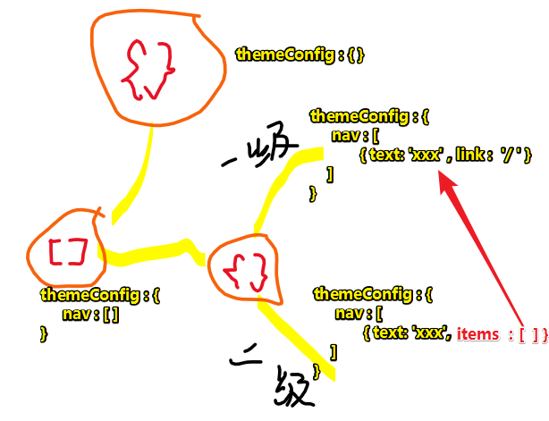
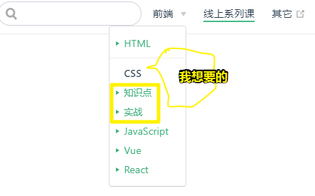

# VuePress 简单入门

## ★引子

换个方式渲染笔记！之前用过gitbook、hexo等工具写过笔记，但都不是很好用啊！如gitbook，文件多了，每次编辑后的重新加载都会需要很多时间。

那么为啥要选择 VuePress（不可思议）呢？

因为 VuePress 专注在**以内容为中心**的**静态**网站上，同时提供了一些为技术文档定制的**开箱即用**的特性。

## ★快速上手

### ◇全局安装

```bash
# 安装
yarn global add vuepress # 或者：npm install -g vuepress

# 新建一个 docs 文件夹
mkdir docs

# 新建一个 markdown 文件
echo '# Hello VuePress!' > docs/README.md

# 开始写作
npx vuepress dev docs

# 构建静态文件
npx vuepress build docs
```

接着，在 `package.json` 里加一些脚本：

①于项目根目录下，`yarn init`一下，这样就会生成一个 `package.json`文件

②添加脚本：

```json
{
  "scripts": {
    "docs:dev": "vuepress dev docs",
    "docs:build": "vuepress build docs"
  }
}
```

③写作和构建静态文件之命令简单化：

```bash
# 开始写作
yarn docs:dev # 或者：npm run docs:dev

# 生成静态的 HTML 文件
yarn docs:build # 或者：npm run docs:build
```

默认情况下，文件将会被生成在 `.vuepress/dist`里边，当然，你也可以通过 `.vuepress/config.js` 中的 `dest` 字段来修改，生成的文件可以部署到任意的静态文件服务器上

### ◇基本配置

#### 配置文件

- 为什么需要？

> 如果没有任何配置，这个网站将会是**非常局限**的，用户也无法在你的网站上自由导航。

- 开搞：

为了更好地自定义自己的网站，所以我得添加些配置文件，如 创建个`config.js`（**一个 VuePress 网站必要的配置文件**），此时项目结构如下：

```text
.
├─ docs
│  ├─ README.md
│  └─ .vuepress
│     └─ config.js
└─ package.json
```

那么该 `config.js`的内容是啥呢？（**导出的是一个 JavaScript 对象**）

```js
module.exports = {
  title: 'Hello VuePress',
  description: 'Just playing around'
}
```

话说，就只有两个key吗？——当然，还有其它的啊！具体详情请点开 [配置 - VuePress](https://vuepress.vuejs.org/zh/config/#%E5%9F%BA%E6%9C%AC%E9%85%8D%E7%BD%AE)，你会发现有11个key，而且每个key有啥作用都详细解释了，如`title`，它是个 `string`类型的，作用是「网站的标题，它将会被用作所有页面标题的前缀，同时，默认主题下，它将显示在导航栏（navbar）上。」

### ◇部署到GitHub Pages

#### 部署前的前置条件

- 文档放置在项目的 `docs` 目录中；
- 使用的是默认的构建输出位置；
- VuePress 以本地依赖的形式被安装到你的项目中，并且配置了如下的 npm scripts:

```json
{
  "scripts": {
    "docs:build": "vuepress build docs"
  }
}
```

> 我用的是全局依赖，所以我无法使用持续集成工具，或者一些其他服务（比如 Netlify）来帮助自己在每次提交代码时自动部署。

#### 开搞

1. 把当前项目搞成是个 git 仓库，并push到远程仓库上
2. 在 `docs/.vuepress/config.js` 中设置正确的 `base`。如 直接添加个`base: "/vuepress-blog/"`即可，注意 `vuepress-blog`是你远程仓库名
3. 在你的项目中，创建一个如下的 `deploy.sh` 文件

```sh
#!/usr/bin/env sh

# 确保脚本抛出遇到的错误
set -e

# 生成静态文件
yarn run docs:build

# 进入生成的文件夹
cd docs/.vuepress/dist

# 如果是发布到自定义域名
# echo 'www.example.com' > CNAME

git init
git add -A
git commit -m 'deploy'

# 如果发布到 https://<USERNAME>.github.io/<REPO>
git push -f git@github.com:ppambler/vuepress-blog.git master:gh-pages

cd -
```

效果：[README - Hello! Ambler](https://ppambler.github.io/vuepress-blog/)

## ★默认主题配置

### ◇首页

在 `docs/README.md`下添加一下内容：

```yaml
---
home: true
heroImage: /hero.png
actionText: 快速上手 →
actionLink: /zh/guide/
features:
- title: 简洁至上
  details: 以 Markdown 为中心的项目结构，以最少的配置帮助你专注于写作。
- title: Vue驱动
  details: 享受 Vue + webpack 的开发体验，在 Markdown 中使用 Vue 组件，同时可以使用 Vue 来开发自定义主题。
- title: 高性能
  details: VuePress 为每个页面预渲染生成静态的 HTML，同时在页面被加载的时候，将作为 SPA 运行。
footer: MIT Licensed | Copyright © 2018-present Evan You
---
```

任何 `YAML front matter` 之后额外的内容将会以普通的 markdown 被渲染，并插入到 `features` 的后面。

> 关于 `/hero.png`，来自于`.vuepress/public`目录下的图片，`public`目录打包后的内容都扔到`dist/`的根目录下。

### ◇导航栏

导航栏有啥？——导航栏可能包含你的**页面标题、搜索框、 导航栏链接、多语言切换、仓库链接**，它们均取决于你的配置

- 语法：



- 开搞：

①创建一个`.vuepress/navbar.js`文件，目的是实现模块化

②往 `navbar.js`里边添加内容：

```js
module.exports = [
  {
    text: '前端', items: [
      { text: 'HTML', link: '/' },
      { text: 'CSS', link: '/' },
      { text: 'JavaScript', link: '/' },
      { text: 'Vue', link: '/' },
      { text: 'React', link: '/' },
    ]
  },
  { text: 'Tools', items: [
    { text: 'VuePress', link: '/tools/01-vuepress/dir.md'},
  ]},
  { text: '线上系列课', link: '/' },
  { text: '其它', link: 'https://google.com' },
]
```

③配置`config.js`：

```json
module.exports = {
  themeConfig: {
    nav: require('./navbar.js'),
  }
}
```

同理，侧边栏也可以这样做

### ◇侧边栏

我直接就是自动生成侧边栏了：

```json
module.exports = {
  themeConfig: {
    nav: require('./navbar.js'),
    sidebar: 'auto',
  }
}
```

> 为啥要自动生成呢？——因为我不想把侧边栏当作是 `01-vuepress` 所有文件的目录，如这样：
>
> **➹：**[数组完全乱序 - 前端进阶积累](http://obkoro1.com/web_accumulate/codeBlack/%E6%95%B0%E7%BB%84%E5%AE%8C%E5%85%A8%E4%B9%B1%E5%BA%8F.html#%E7%9C%9F%E6%AD%A3%E6%84%8F%E4%B9%89%E4%B8%8A%E7%9A%84%E4%B9%B1%E5%BA%8F%E6%95%B0%E7%BB%84%EF%BC%9A)
>
> 可见，侧边栏有很多不相关的内容，而这会影响自己对当前文件的阅读，总之就是分散了注意力呗！
>
> 如果要展示当前 `01-vuepress` 目录下所有的笔记文件，那么我可以在 `01-vuepress`下新建一个 `dir.md`，然后给上相对链接即可！如：
>
> ```markdown
> # README
> 
> - [01- 简单使用一下 vuepress](./01.md)
> ```

**➹：**[默认主题 - VuePress](https://vuepress.vuejs.org/zh/default-theme-config/#%E8%87%AA%E5%8A%A8%E7%94%9F%E6%88%90%E4%BE%A7%E6%A0%8F)

### ◇其它配置？

- `markdown: {lineNumbers: true}`：为代码块显示行数
- ……

**➹：** [配置 - VuePress](https://vuepress.vuejs.org/zh/config/#chainwebpack)

## ★参考链接

**➹：**[手把手带你搭建VuePress的技术博客 - 掘金](https://juejin.im/post/5c94ddf35188252d65344cfe#heading-8)

**➹：**[VuePress 手摸手教你搭建一个类Vue文档风格的技术文档/博客 - OBKoro1分享 - SegmentFault 思否](https://segmentfault.com/a/1190000016333850)

**➹：**[VuePress自动生成侧边栏 - 浅墨散人](https://fangzheng.xyz/Other/VuePress/1.vuepress-auto-sidebar.html#%E6%95%88%E6%9E%9C)

**➹：** [飞跃高山与大洋的鱼](https://docs.shanyuhai.top/)

**➹：**[Home | Chaves Gu](https://www.chavesgu.com/)

**➹：**[★从今天开始，拿起VuePress打造属于自己的专属博客 - 掘金](https://juejin.im/post/5cd7d3286fb9a0323a01d29a)

**➹：**[★使用七牛云存储图片 之 上传图片 · Issue #7 · JZLeung/blog](https://github.com/JZLeung/blog/issues/7)

## ★总结

- 基本与[原先记笔记的习惯](https://ppambler.github.io/fe-learn-2018/)一致

  - 让我感到爽的：
    - 样式好看了很多！
    - 回顾笔记方便很多！
    - 不用把链接的 `|` 转化成 `-`了，之前把markdown上传到github上，直接用 GitHub Pages 浏览的话 会把 `|`解析成表格
  - 让我感到不爽的：
    - 把打包好的文件上传到 `gh-pages` 很费时间！
    - 关于图片，使用 Typora  拷贝粘贴图片默认是这样的：``，而vuepress的打包之后的结果要有图片的话，得这样 ``

  所以到底要不要用 vuepress 来记笔记呢？嗯，这是个需要权衡的问题，经过深思熟虑之后，我觉得可以把 vuepress 当作最新的记笔记习惯，毕竟我现在对 vuepress 的认识还是浅陋的，我想它一定还有很多骚操作、骚功能等着自己去挖掘！

## ★Q&A

### ① `yarn init`?

1. 可以创建 `package.json`
2. 可以更新 `package.json`

`yarn init --yes`可以跳过互动式操作，即不需要每次都摁 `Enter`了。

**➹：** [yarn init - Yarn中文网](http://yarnpkg.top/Cliinit.html)

### ②yaml 无效？

默认主题提供了一个[首页](https://vuepress.vuejs.org/zh/)（Homepage）的布局 ，于是我就使用了它，那么如何使用呢？——很简单，在`doc/README.md`里边添加以下配置即可：

```yaml
---
home: true
heroImage: /hero.png
actionText: 快速上手 →
actionLink: /zh/guide/
features:
- title: 简洁至上
  details: 以 Markdown 为中心的项目结构，以最少的配置帮助你专注于写作。
- title: Vue驱动
  details: 享受 Vue + webpack 的开发体验，在 Markdown 中使用 Vue 组件，同时可以使用 Vue 来开发自定义主题。
- title: 高性能
  details: VuePress 为每个页面预渲染生成静态的 HTML，同时在页面被加载的时候，将作为 SPA 运行。
footer: MIT Licensed | Copyright © 2018-present Evan You
---
```

然而，并没有出现我想要的效果，即这段配置直接被渲染成普通文本了

那么，为啥会咩有这样的效果呢？

我想了想，我是在 `yarn docs:dev`这个状态下添加的配置，于是我就重新了 `yarn docs:dev`了一下，结果效果出来了！

或许 `yarn docs:dev`只会针对markdown的文本编辑更新，然后渲染，而涉及到配置相关的，唯有重新 `yarn docs:dev`一下才会起效果

总之，千万不要在VS Code里边编辑该文件，因为一编辑保存就会在文件的顶部添加这个：

```text
/*
 * @Description: In User Settings Edit
 * @Author: your name
 * @Date: 2019-08-14 09:49:56
 * @LastEditTime: 2019-08-14 15:34:16
 * @LastEditors: Please set LastEditors
 */
```

导致 `yaml`失效

所以，我就不在 VS Code 里边写 markdown 了，当然，这样一来，就不知道到该笔记是啥时候最后一次更新了。

> 这个头部注释来自于我安装的这个插件：[koro1FileHeader](https://github.com/OBKoro1/koro1FileHeader)
>
> 那么，我只好禁用它了！

### ③ ``.vuepress/public`` 是个怎么样的目录？ 

该目录是用来放置静态资源的，打包出来之后会放在`.vuepress/dist/`的根目录里边。

### ④Vuepress的配置更改能否热更新？

如我更改了 `config.js`，结果没有发生热更新，只有编辑markdown笔记才会有，注意，编辑 `yaml`也不会有热更新！

### ⑤Vuepress的导航栏能否支持三级菜单？

我这样搞了：

```json
{
  themeConfig: {
    nav: [
      { text: '前端', items: [
        { text: 'HTML', link:'/'},
        { text: 'CSS', items:[
          {text: '知识点', link: '/'},
          {text: '实战', link: '/'},
        ]},
        { text: 'JavaScript', link:'/'},
        { text: 'Vue', link:'/'},
        { text: 'React', link:'/'},
      ] },
      { text: '线上系列课', link: '/' },
      { text: '其它', link: 'https://google.com' },
    ]
  }
}
```

结果：



难道就只支持二级菜单？

### ⑥为啥当前目录下的图片目录(img)没有打包到dist目录里边？

当我改为 `public`这个名字，居然就起作用了！

### ⑦我在当前目录下搞了个README.md文件来作为 01-vuepress 下所有笔记文件的目录？

结果不起作用，于是我又换个名字，比如叫 `dir`，结果ok了！

> `README.md`会被自动编译为 `index.html`，所以你先点击 `vuepress`菜单跳转到 `README.md`可以写成是 `/tools/01-vuepress/`

**➹：**[Markdown 拓展 | VuePress](https://vuepress.vuejs.org/zh/guide/markdown.html#%E9%93%BE%E6%8E%A5)

### ⑧为啥 sidebar 不显示4级标题？

> 默认情况下，侧边栏会自动地显示由当前页面的标题（headers）组成的链接，并按照页面本身的结构进行嵌套，你可以通过 `themeConfig.sidebarDepth` 来修改它的行为。默认的深度是 `1`，它将提取到 `h2`的标题，设置成 `0` 将会禁用标题（headers）链接，同时，最大的深度为 `2`，它将同时提取 `h2` 和 `h3` 标题。

也就是说最多就是3级标题了。

**➹：**[默认主题 - VuePress](https://vuepress.vuejs.org/zh/default-theme-config/#%E5%B5%8C%E5%A5%97%E7%9A%84%E6%A0%87%E9%A2%98%E9%93%BE%E6%8E%A5)

