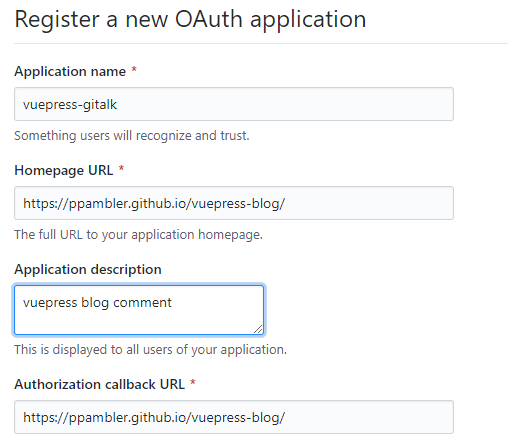
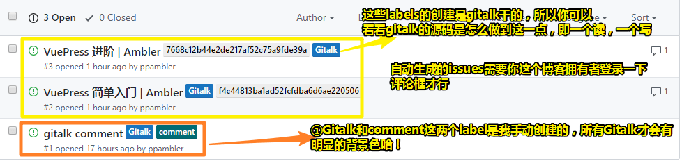

# VuePress 进阶

## ★添加评论功能

### ◇Gitalk 

**①安装[Gitalk](https://github.com/gitalk/gitalk#install)**

``` bash
yarn add gitalk
# or npm i --save gitalk
```

**②Register a new [OAuth](https://github.com/settings/applications/new) application**



**③有两种姿势添加评论（选择第二种）**

1. 全局添加评论，即评论功能是共用的。做法是在 创建一个文件 `.vuepress/enhanceApp.js` ，并添加以下代码：

``` js
function integrateGitalk(router) {
  const linkGitalk = document.createElement('link');
  linkGitalk.href = 'https://cdn.jsdelivr.net/npm/gitalk@1/dist/gitalk.css';
  linkGitalk.rel = 'stylesheet';
  document.body.appendChild(linkGitalk);
  const scriptGitalk = document.createElement('script');
  scriptGitalk.src = 'https://cdn.jsdelivr.net/npm/gitalk@1/dist/gitalk.min.js';
  document.body.appendChild(scriptGitalk);

  router.afterEach((to) => {
    if (scriptGitalk.onload) {
      loadGitalk(to);
    } else {
      scriptGitalk.onload = () => {
        loadGitalk(to);
      }
    }
  });

  function loadGitalk(to) {
    let commentsContainer = document.getElementById('gitalk-container');
    if (!commentsContainer) {
      commentsContainer = document.createElement('div');
      commentsContainer.id = 'gitalk-container';
      commentsContainer.classList.add('content');
    }
    const $page = document.querySelector('.page');
    if ($page) {
      $page.appendChild(commentsContainer);
      if (typeof Gitalk !== 'undefined' && Gitalk instanceof Function) {
        renderGitalk(to.fullPath);
      }
    }
  }

  function renderGitalk(fullPath) {
    const gitalk = new Gitalk({
      clientID: '960……',
      clientSecret: '32f……', // come from github development
      repo: 'vuepress-blog',
      owner: 'ppambler',
      admin: ['ppambler'],
      id: 'comment',
      distractionFreeMode: false,
      language: 'zh-CN',
    });
    gitalk.render('gitalk-container');
  }
}

export default ({
  Vue,
  options,
  router
}) => {
  try {
    document && integrateGitalk(router)
  } catch (e) {
    console.error(e.message)
  }
}
```

2. 局部添加，每个markdown笔记自行决定是否添加评论，如果添加，那就在笔记的末尾添加 `<ClientOnly><Comment/></ClientOnly>` 。做法是创建一个vue组件 `.vuepress/components/Comment.vue` ，然后添加下边的代码即可！（注意：vuepress会自动注册这个组件，无需自己主动注册该组件！总之组件写好了，就可以直接在markdown笔记里使用了！对了，你可以自行决定是否安装个md5，如果不安装的话，gitalk的id值的长度很有可能会超过50）

``` vue
<template>
  <div id="gitalk-container" class="comment"></div>
</template>
<script>
import 'gitalk/dist/gitalk.css'
import Gitalk from 'gitalk'
import md5 from 'blueimp-md5'
export default {
  name: '',
  data() {
    return {
      gitalk: new Gitalk({
        clientID: '960……', //GitHub Application Client ID
        clientSecret: '32f……', //GitHub Application Client Secret.
        repo: 'vuepress-blog', //GitHub repository
        owner: 'ppambler', //GitHub repository 所有者，可以是个人或者组织
        admin: ['ppambler'], //GitHub repository 的所有者和合作者 (对这个 repository 有写权限的用户)
        id: md5(window.location.pathname), //页面的唯一标识。长度必须小于50
        distractionFreeMode: false,
        language: 'zh-CN',
      })
    }
  },
  mounted(){
    this.gitalk.render("gitalk-container");
  }

}
</script>
<style>
.comment {
  padding: 1rem;
}
</style>
```

**④打开该含有评论的页面，然后登录，这样才会初始化一个issues。当你打开你的博客仓库的issues，你就会发现多了一个新鲜出炉的issues，而这个issues是自动创建的，并且带有相应的labels。**



**⑤效果**

**➹：**[Issues · ppambler/vuepress-blog](https://github.com/ppambler/vuepress-blog/issues)

**⑥关于 Gitalk的原理**

1. 它调用的接口（url也是API的一种，就像苹果也是水果的一种）如下

``` bash
https://api.github.com/repos/${owner}/${repo}/issues?client_id=${clientID}&client_secret=${clientSecret}&labels=Gitalk,${id}
```

你可以看到这些参数值，就是我们为Gitalk写的[Options](https://github.com/gitalk/gitalk/blob/master/readme-cn.md#%E8%AE%BE%E7%BD%AE)

其中，labels默认就带了个 `Gitalk` ，所以你可以自行先在issues里边创建个 颜色好看的 `Gitalk` label

### ◇Valine

要想有数据库服务，那么你得注册leancloud，而这目前需要实名认证，当然，你用国际版的，就无须实名认证了。

**➹：**[Vuepress 搭建带评论功能的静态博客 - 掘金](https://juejin.im/post/5bf047796fb9a04a06047409#heading-10)

**➹：**[快速开始 | Valine](https://valine.js.org/quickstart.html)

### ◇Vssue

> **Vssue** 的灵感来自于 [**Gitment**](https://github.com/imsun/gitment) 和 [**Gitalk**](https://github.com/gitalk/gitalk)，但是和它们有些区别：
>
> - **Vssue** 支持 Github、Gitlab 和 Bitbucket，并且很容易扩展到其它平台。**Gitment** 和 **Gitalk** 仅支持 Github。
> - **Vssue** 可以发表、编辑、删除评论。**Gitment** 和 **Gitalk** 仅能发表评论。
> - **Vssue** 是基于 [Vue.js](https://vuejs.org/) 开发的，可以集成到 Vue 项目中，并且提供了一个 [Vuepress 插件](https://vssue.js.org/zh/guide/vuepress.html)。 **Gitment**基于原生JS，而 **Gitalk** 基于 [Preact](https://github.com/developit/preact)。

**➹：**[介绍 | Vssue](https://vssue.js.org/zh/guide/#vssue-%E6%98%AF%E5%A6%82%E4%BD%95%E5%B7%A5%E4%BD%9C%E7%9A%84)

**➹：**[看看Vssue的效果 | Chaves Gu](https://www.chavesgu.com/posts/2019/03/06/vue-component/)

---

## ★添加标签功能

## ★参考链接

**➹：** [★利用Gitalk给Vuepress搭建的blog增加评论功能 · 乌云压顶是吧](https://wyydsb.xin/javaScript/comment.html#oauth-application)

**➹：**[Usage | IO](https://wuwaki.me/yubisaki/usage.html#%E8%AF%84%E8%AE%BA%E7%B3%BB%E7%BB%9F)

**➹：**[Gitalk评论系统 · Issue #10 · Will0319/blog](https://github.com/Will0319/blog/issues/10)

**➹：**[★给你的 VuePress 添加 Gitalk 评论插件吧 - 掘金](https://juejin.im/post/5c9e30fb6fb9a05e1c4cecf6)

## ★总结

* 在写Comment组件的时候，可以使用 [Vue Template - CodeSandbox](https://codesandbox.io/s/vue-template-kubts) 来测试！而不是在本地创建一个Vue应用去测试！毕竟CodeSanbox里边的安装依赖是贼容易、贼方便！

## ★Q&A

### ① `npm install -D xxx` 的 `-D` 为何意？

话说，这是 `--save-dev` 的缩写吗？或者说这是它的别名吗？

解决姿势：

1. `npm install --help` ：查看install命令需要那些参数，结果没有找到我想要的结果

``` bash
npm install (with no args, in package dir)
npm install [<@scope>/]<pkg>
npm install [<@scope>/]<pkg>@<tag>
npm install [<@scope>/]<pkg>@<version>
npm install [<@scope>/]<pkg>@<version range>
npm install <folder>
npm install <tarball file>
npm install <tarball url>
npm install <git:// url>
npm install <github username>/<github project>

aliases: i, isntall, add
common options: [--save-prod|--save-dev|--save-optional] [--save-exact] [--no-save]
```

而[官网](https://docs.npmjs.com/cli/install)就给了答案：

``` bash
npm install (with no args, in package dir)
npm install [<@scope>/]<name>
npm install [<@scope>/]<name>@<tag>
npm install [<@scope>/]<name>@<version>
npm install [<@scope>/]<name>@<version range>
npm install <git-host>:<git-user>/<repo-name>
npm install <git repo url>
npm install <tarball file>
npm install <tarball url>
npm install <folder>

aliases: npm i, npm add
common options: [-P|--save-prod|-D|--save-dev|-O|--save-optional] [-E|--save-exact] [-B|--save-bundle] [--no-save] [--dry-run]
```

可见 `-D` 是 `--save-dev` 的缩写！

其它缩写：

1. `install` ： `i` 
2. `--global` ： `-g` 
3. `--save` ： `-S` ，项目发布之后还依赖的东西
4. `--save-dev` ： `-D` ，项目开发时候依赖的东西

**➹：** [NPM小结 - 程序猿小卡 - 博客园](https://www.cnblogs.com/chyingp/p/npm.html)

**➹：**[npm-install | npm Documentation](https://docs.npmjs.com/cli/install)

**➹：**[npm install 命令参数的一些简写方式 | 清风轩](https://xovel.cn/article/npm-alias.html)

### ②话说，在npm里边发布的包 可以使用 yarn 直接安装吗？

比如说官网给出的gitalk咩有指明可以使用yarn安装……

我之前只在npm上发布了一个包：

**➹：**[warm-ui-test-1 - npm](https://www.npmjs.com/package/warm-ui-test-1)

然而在yarn上也可以找到这个包：

**➹：**[warm-ui-test-1 | Yarn](https://yarnpkg.com/zh-Hans/package/warm-ui-test-1)

按照官网的解释：

> 为了通过 Yarn 共享你的包给全世界的其他开发者，你需要先发布它。
>
> 通过 Yarn 发布的包会托管在 [npm registry](https://www.npmjs.com/) 上，用于全球分发。

可见这包都在 npm 里边托管，而这些包的下载有两种姿势：

1.npm
2.yarn

::: warning
如果你安装 vuepress 时，是用的 yarn ，那么之后需要安装其它包的操作，最好也是用 yarn 来搞，不然会发生不可预知的错误！或许这是因为 Yarn 有它自己的一套解析算法 来组织 `node_modules` 目录，而 npm 也有一套自己的解析算法！

:::

**➹：** [javascript - npm发布和yarn发布能混用吗？ - SegmentFault 思否](https://segmentfault.com/q/1010000019022061)

**➹：** [yarnpkg - What is the equivalent of "npm install --save" in Yarn? - Stack Overflow](https://stackoverflow.com/questions/40134390/what-is-the-equivalent-of-npm-install-save-in-yarn)

**➹：**[Yarn安装与使用详细介绍 | Never_yu's Blog](https://neveryu.github.io/2018/07/20/yarn/)

**➹：** [从 npm 迁移 | Yarn](https://yarnpkg.com/lang/zh-hans/docs/migrating-from-npm/)

### ③OAuth是啥？

[OAuth 2.0](http://www.ruanyifeng.com/blog/2014/05/oauth_2_0.html) 是目前最流行的授权机制，用来授权第三方应用，获取用户数据。

如xxx用户想要评论博客，那么xxx用户（第三方应用）得授权通过才行。

哈！其实我理解错了，根据[这个](https://wyydsb.xin/javaScript/comment.html#oauth-application)：

> Gitalk, Gitment 都是基于 `GitHub Issue` 作为Comment
>
> 那么Gitalk和Gitment的原理就相对于调用Github issue的接口对issue内容进行提取展示在div内
>
> 那么必须**对你的某个repository的issue进行授权**
>
> 这就是 `OAuth application` 

也就是说，你想要拿到issue的数据，必需要得到我们注册的OAuth应用——vuepress-gitalk的授权才行，而得到它的授权以后，你才能去更改issue的数据，删除自己issue的数据！不然，你只有读数据这样的大众权利！

**➹：**[OAuth 2.0 的一个简单解释 - 阮一峰的网络日志](http://www.ruanyifeng.com/blog/2019/04/oauth_design.html)

### ④Vue组件使用？

所有在 `.vuepress/components` 中找到的 `*.vue` 文件将会**自动地被注册为全局的异步组件**，如：

``` text
.
└─ .vuepress
   └─ components
      ├─ demo-1.vue
      ├─ OtherComponent.vue
      └─ Foo
         └─ Bar.vue
```

你可以**直接使用这些组件在任意的 Markdown 文件**中（**组件名是通过文件名取到的**）：

``` md
<demo-1/>
<OtherComponent/>
<Foo-Bar/>
```

注意，自定义组件的名字包含连接符或者是 PascalCase。不然，就会导致 HTML 渲染紊乱，因为你不准守这样的约定的话，那么该组件将被当作是内联元素，然后被包裹在一个 `p` 标签中，而HTML 标准规定， `<p>` 标签中不允许放置任何块级元素。

> 其实这样 `comment.vue` 也是ok的！不过最好还是按照 vuepress 的约定来！

**➹：** [在 Markdown 中 使用 Vue | VuePress 1.x](https://v1.vuepress.vuejs.org/zh/guide/using-vue.html#%E4%BD%BF%E7%94%A8%E7%BB%84%E4%BB%B6)

### ⑤Gitalk能自动为 issues 生成 labels 吗？

可以自动生成，你只需要往评论框里边登录一下你的github就好了！

### ⑥如何引入md5？

我之所以要引入[md5](https://github.com/blueimp/JavaScript-MD5)是因为需要把gitalk的id选项给md5化了。

做法如下：

1. `yarn add blueimp-md5` 
2. 在 `Comment.vue` 组件里边引入它： `import md5 from 'blueimp-md5'` ，这得到的是一个md5函数
3. 可以data里边直接 `id: md5(window.location.pathname)` 

遇到的坑，主要是对md5的引入 ：

我之前直接把这个[url](https://cdn.bootcss.com/blueimp-md5/2.11.1/js/md5.min.js)的内容拷贝到本地了，然后就在 `Comment.vue` 引入了，而引入的姿势有好几种：

``` js
// import md5 from '../helper/md5.js'
// const md5 = require('../helper/md5.js')
// import {md5} from '../helper/md5.js'
import md5 from 'blueimp-md5' //成功，其它注释的都不成功
// require('/md5')
// import '../helper/md5.js'
```

`require` 的语法需要js文件是这样的 `module.exports = {}` 

总之，还是用安装模块的姿势来使用第三方库！

对了，在做单文件测试时，如搞个评论组件，可以使用 <https://codesandbox.io/s/vue-template-kubts> 来搞！而不是在本地搞！

### ⑦window is not defined？

代码是这样的： `md5(window.location.pathname)` 

在 `vuepress build docs` 的时候，就报 了这个错误，而在 `vuepress dev docs` 时，是咩有报这个错的！

解决（这是一个浏览器的 API 访问被限制的问题）：

> 当你在开发一个 VuePress 应用时，由于所有的页面在生成静态 HTML 时都需要通过 Node.js 服务端渲染，因此所有的 Vue 相关代码都应当遵循 [编写通用代码](https://ssr.vuejs.org/zh/universal.html) 的要求。简而言之，请确保只在 `beforeMount` 或者 `mounted` 访问浏览器 / DOM 的 API。
>
> 如果你正在使用，或者需要展示一个对于 SSR 不怎么友好的组件（比如包含了自定义指令），你可以将它们包裹在内置的 `<ClientOnly>` 组件中：

``` md
<ClientOnly>
  <NonSSRFriendlyComponent/>
</ClientOnly>
```

所以我直接这样即可：

``` md
<ClientOnly>
  <Comment/>
</ClientOnly>
```

总之， `Comment` 组件不是在服务端渲染，而是在客户端渲染的，唯有这样 `window` 才会被浏览器访问到！

**➹：**[在 Markdown 中 使用 Vue | VuePress](https://vuepress.vuejs.org/zh/guide/using-vue.html#%E6%B5%8F%E8%A7%88%E5%99%A8%E7%9A%84-api-%E8%AE%BF%E9%97%AE%E9%99%90%E5%88%B6)

**➹：**[vuepress build docs Error · Issue #1328 · vuejs/vuepress](https://github.com/vuejs/vuepress/issues/1328)

### ⑧Gitalk于页面渲染成功后，「未找到相关的issues 进行评论，请联系 @xxx 初始化创建」？

::: warning

第一次Gitalk的渲染到页面需要初始化评论，即你需要先点击 `使用GitHub登陆` ，然后刷新页面才会初始化，或者自己去仓库里手动创建一个issues，并添加issues的 `labels` 值为Gitalk的 `labels` 参数和 `id` 参数的值。

:::

关于到仓库里手动创建一个issues并添加相应的labels，可以自行写个自动化脚本去搞！

你可以用ruby写，或者nodejs等语言去写（可以去参考他人是如何写的，思路主要是你可以增删改查你的issues），其中api有（需要获取github接口的调用权限）：

* [一篇文章搞定Github API 调用 (v3） - Solomon's 技术专栏 - SegmentFault 思否](https://segmentfault.com/a/1190000015144126)
  + 测试 [拿到vuepress-blog仓库的issue数据](https://api.github.com/repos/ppambler/vuepress-blog/issues)

> 权衡一下，自己觉得没有必要去写！（一个字概括自己，「懒」！）
>

**➹：**[自动初始化Gitalk评论 | Gitalk | blog | nodejs | gulp | Edison Xu's Blog](http://edisonxu.com/2018/10/31/gitalk-auto-init.html)

**➹：**[能不能设置成自动创建Issues? · Issue #91 · gitalk/gitalk](https://github.com/gitalk/gitalk/issues/91)

**➹：**[评论初始化 · gitalk/gitalk Wiki](https://github.com/gitalk/gitalk/wiki/%E8%AF%84%E8%AE%BA%E5%88%9D%E5%A7%8B%E5%8C%96)

**➹：**[Gitalk评论插件使用教程 - 个人文章 - SegmentFault 思否](https://segmentfault.com/a/1190000018072952)

**➹：**[自动初始化 Gitalk 和 Gitment 评论](https://draveness.me/git-comments-initialize)

---

