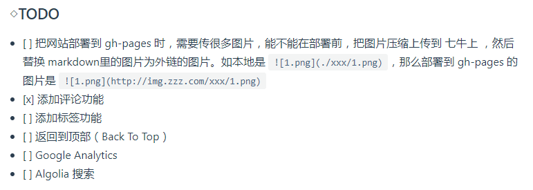
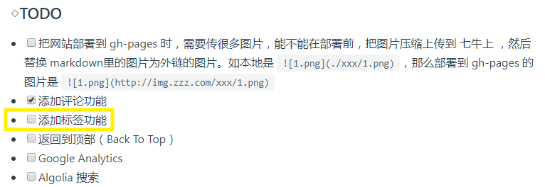
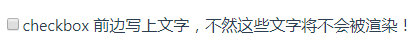

# FAQ

## ①不支持 「任务列表」语法？



如何让它支持这样的语法？



**① `0.x` 的语法**

``` js
module.exports = {
  markdown: {
    lineNumbers: true,
    // markdown-it-anchor 的选项
    anchor: {
      permalink: false
    },
    // markdown-it-toc 的选项
    toc: {
      includeLevel: [1, 2]
    },
    // 
    checkbox: {
      divWrap: true,
      divClass: 'cb',
      idPrefix: 'cbx_'
    },
    config: md => {
      // 使用更多的 markdown-it 插件!
      md.use(require('markdown-it-checkbox'))
    }
  },
}
```

**② `1.x` 的语法**

``` js
module.exports = {
  markdown: {
    // markdown-it-anchor 的选项
    anchor: {
      permalink: false
    },
    // markdown-it-toc 的选项
    toc: {
      includeLevel: [1, 2]
    },
    extendMarkdown: md => {
      // 使用更多的 markdown-it 插件!
      md.use(require('markdown-it-xxx'))
    }
  }
}
```

::: warning

我被 `x.0` 的语法坑了！我之前一直看的是 `x.0` 的语法

:::

关于checkbox的选项，可以参考anchor的[选项](https://www.npmjs.com/package/markdown-it-anchor)是怎么来的，然后你就可以依葫芦画瓢的去写checkbox的[选项](https://github.com/mcecot/markdown-it-checkbox)了。

如markdown-it-checkbox给出的用法是这样的：

``` js
var md = require('markdown-it')()
  .use(require('markdown-it-checkbox'), {
    divWrap: true,
    divClass: 'cb',
    idPrefix: 'cbx_'
  });

md.render('[ ] unchecked') // =>
// <p>
//  <div classname="cb">
//    <input type="checkbox" id="cbx_0">
//    <label for="cbx_0">unchecked</label>
//  </div>
// </p>
```

那么你只需要关注这个**选项** 即可：

``` js
{
  divWrap: true,
  divClass: 'cb',
  idPrefix: 'cbx_'
}
```

至于渲染，vuepress遇到下边这样的语法：

``` md
[ ] unchecked
```

就会渲染成这样：

[ ] unchecked

::: warning

如果你不想让markdown-it-checkbox这个扩展去解析渲染 \[  \] unchecked ，那么你就用代码块语法（\ `\` \ ` \` \ `\` ），或者（ `\` ）转义，而不是直接 代码 语法( \ ` ` ）

:::

**➹：**[Markdown 拓展 | VuePress 1.x](https://v1.vuepress.vuejs.org/zh/guide/markdown.html#%E8%BF%9B%E9%98%B6%E9%85%8D%E7%BD%AE)

**➹：**[在 Vuepress 中使用 | markdown-it-vuese](https://buptsteve.github.io/markdown-it-vuese/zh/example/vuepress.html#_0-x)

**➹：**[优质的 Markdown-It 插件 | 小昱个人网站 | 昱之家](http://blog.xiaoyulive.top/favorite/docs/Plugins_Markdown_It.html#%E5%89%8D%E8%A8%80)

**➹：**[markdown-it/markdown-it: Markdown parser, done right.100% CommonMark support, extensions, syntax plugins & high speed](https://github.com/markdown-it/markdown-it)

## ②vuepress插件开发？

**➹：**[示例 | markdown-it-vuese](https://buptsteve.github.io/markdown-it-vuese/zh/example/#%E4%BD%BF%E7%94%A8%E7%A4%BA%E4%BE%8B)

**➹：**[demo-code](https://buptsteve.github.io/vuepress-plugin-demo-code/zh/#features)

**➹：**[使用 markdown-it 解析 markdown 代码（读 VuePress 三） - 掘金](https://juejin.im/post/5bbccf3cf265da0aee3f317b#heading-12)

## ③基于Vuepress的markdown书写规范？

**①CheckBox**

**Input**

``` md
不要在 [ ] checkbox 前边写上文字，不然这些文字将不会被渲染！
```

**Output**



